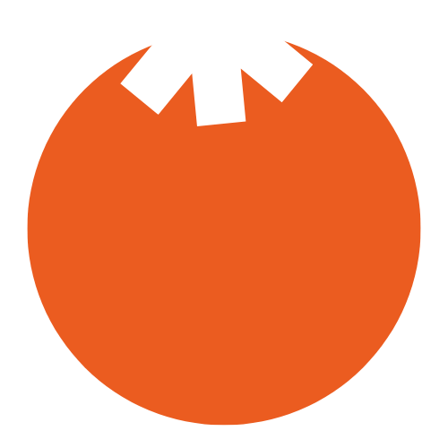
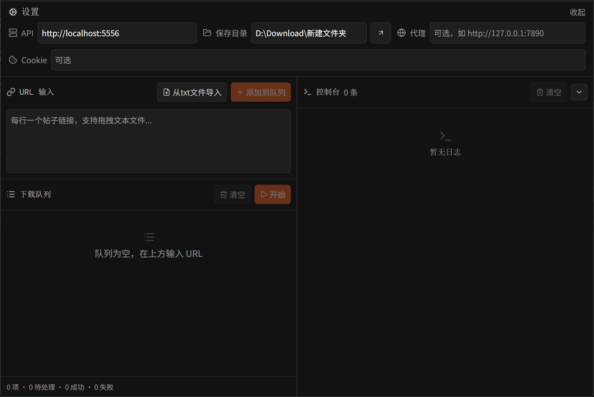

<div align="center">
<br>
<h1>Mikan</h1>
<br>


 
</div>
<br>

# 使用方法

配合<a href="https://github.com/JoeanAmier/XHS-Downloader" target="_blank">XHS-Downloader</a>食用

---

# 项目程序功能清单

 - ✅ 批量下载
 - ✅ 提取详情到md 

---

# 程序截图



---

# 程序运行

先决条件 <a href="https://rust-lang.org/tools/install/" target="_blank">rust</a> 环境

### 1.开发
```bash
pnpm tauri dev
```

### 2.打包
- #### win打包exe

```bash
pnpm tauri build -- --no-bundle
```

---

# 免责声明
使用者对本项目的使用由使用者自行决定，并自行承担风险。作者对使用者使用本项目所产生的任何损失、责任、或风险概不负责。

本项目的作者提供的代码和功能是基于现有知识和技术的开发成果。作者按现有技术水平努力确保代码的正确性和安全性，但不保证代码完全没有错误或缺陷。

本项目依赖的所有第三方库、插件或服务各自遵循其原始开源或商业许可，使用者需自行查阅并遵守相应协议，作者不对第三方组件的稳定性、安全性及合规性承担任何责任。

使用者在使用本项目时必须严格遵守 GNU General Public License v3.0 的要求，并在适当的地方注明使用了 GNU General Public License v3.0 的代码。

使用者在使用本项目的代码和功能时，必须自行研究相关法律法规，并确保其使用行为合法合规。任何因违反法律法规而导致的法律责任和风险，均由使用者自行承担。

使用者不得使用本工具从事任何侵犯知识产权的行为，包括但不限于未经授权下载、传播受版权保护的内容，开发者不参与、不支持、不认可任何非法内容的获取或分发。

本项目不对使用者涉及的数据收集、存储、传输等处理活动的合规性承担责任。使用者应自行遵守相关法律法规，确保处理行为合法正当；因违规操作导致的法律责任由使用者自行承担。

使用者在任何情况下均不得将本项目的作者、贡献者或其他相关方与使用者的使用行为联系起来，或要求其对使用者使用本项目所产生的任何损失或损害负责。

基于本项目进行的任何二次开发、修改或编译的程序与原创作者无关，原创作者不承担与二次开发行为或其结果相关的任何责任，使用者应自行对因二次开发可能带来的各种情况负全部责任。

本项目不授予使用者任何专利许可；若使用本项目导致专利纠纷或侵权，使用者自行承担全部风险和责任。未经作者或权利人书面授权，不得使用本项目进行任何商业宣传、推广或再授权。

作者保留随时终止向任何违反本声明的使用者提供服务的权利，并可能要求其销毁已获取的代码及衍生作品。

作者保留在不另行通知的情况下更新本声明的权利，使用者持续使用即视为接受修订后的条款。

在使用本项目的代码和功能之前，请您认真考虑并接受以上免责声明。如果您对上述声明有任何疑问或不同意，请不要使用本项目的代码和功能。如果您使用了本项目的代码和功能，则视为您已完全理解并接受上述免责声明，并自愿承担使用本项目的一切风险和后果。
